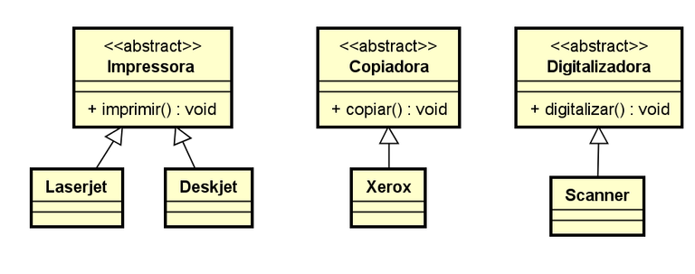
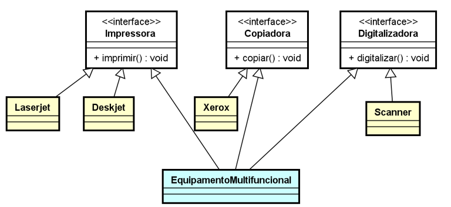

> Java não permite:
>
>   - Herança Multipla
>   
>
> 

## Interface é o nível mais abstrado de um objeto.

### Exemplo de Herança entre Classes.



### Exemplo de aplicação de Herança Múltipla, através de Interface



---

### Devemos compreender que, assim como em classes e métodos abstratos, quando herdamos de uma interface, precisamos implementar:

-  ### todos os seus métodos, pois os mesmos são implicitamente  ``` public abstract ```
